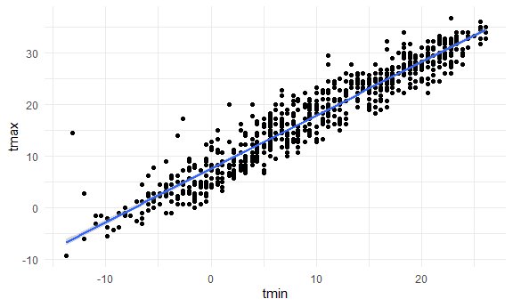

Iteration and List Columns
================

Load key packages.

``` r
library(tidyverse)
library(rvest)
```

    ## 
    ## Attaching package: 'rvest'

    ## The following object is masked from 'package:readr':
    ## 
    ##     guess_encoding

## Make a list

``` r
l = 
  list(
    vec_numeric = 1:23,
    char_vec = c("Jeff"),
    mat = matrix(1:8, nrow = 2, ncol = 4), 
    summary = summary(rnorm(1000, mean = 4))
  )

l
```

    ## $vec_numeric
    ##  [1]  1  2  3  4  5  6  7  8  9 10 11 12 13 14 15 16 17 18 19 20 21 22 23
    ## 
    ## $char_vec
    ## [1] "Jeff"
    ## 
    ## $mat
    ##      [,1] [,2] [,3] [,4]
    ## [1,]    1    3    5    7
    ## [2,]    2    4    6    8
    ## 
    ## $summary
    ##    Min. 1st Qu.  Median    Mean 3rd Qu.    Max. 
    ##   1.128   3.339   4.036   4.036   4.744   7.776

``` r
# call specific items in the list
l[[1]]
```

    ##  [1]  1  2  3  4  5  6  7  8  9 10 11 12 13 14 15 16 17 18 19 20 21 22 23

``` r
l[["vec_numeric"]] # does same as line above
```

    ##  [1]  1  2  3  4  5  6  7  8  9 10 11 12 13 14 15 16 17 18 19 20 21 22 23

``` r
l$mat
```

    ##      [,1] [,2] [,3] [,4]
    ## [1,]    1    3    5    7
    ## [2,]    2    4    6    8

## Make a different list

``` r
list_normals = 
  list(
    a = rnorm(30, mean = 3, sd = 1),
    b = rnorm(30, mean = 30, sd = 1),
    c = rnorm(30, mean = 3, sd = 10),
    d = rnorm(30, mean = -3, sd = 4)
  )
```

(copy and paste the function from last time)

``` r
source("source/mean_and_sd.R")
```

``` r
# find mean and sd of each item in the list (each item consists of multiple values)
mean_and_sd(list_normals[[1]])
```

    ## # A tibble: 1 × 2
    ##    mean    sd
    ##   <dbl> <dbl>
    ## 1  3.48 0.938

``` r
mean_and_sd(list_normals[[2]])
```

    ## # A tibble: 1 × 2
    ##    mean    sd
    ##   <dbl> <dbl>
    ## 1  30.1 0.940

``` r
mean_and_sd(list_normals[[3]])
```

    ## # A tibble: 1 × 2
    ##    mean    sd
    ##   <dbl> <dbl>
    ## 1  5.75  10.4

``` r
mean_and_sd(list_normals[[4]])
```

    ## # A tibble: 1 × 2
    ##    mean    sd
    ##   <dbl> <dbl>
    ## 1 -2.71  3.62

Use a loop to iterate!!

``` r
# create empty list
output = vector("list", length = 4)

for (i in 1:4) {
  
  output[[i]] = mean_and_sd(list_normals[[i]])
  
}

output
```

    ## [[1]]
    ## # A tibble: 1 × 2
    ##    mean    sd
    ##   <dbl> <dbl>
    ## 1  3.48 0.938
    ## 
    ## [[2]]
    ## # A tibble: 1 × 2
    ##    mean    sd
    ##   <dbl> <dbl>
    ## 1  30.1 0.940
    ## 
    ## [[3]]
    ## # A tibble: 1 × 2
    ##    mean    sd
    ##   <dbl> <dbl>
    ## 1  5.75  10.4
    ## 
    ## [[4]]
    ## # A tibble: 1 × 2
    ##    mean    sd
    ##   <dbl> <dbl>
    ## 1 -2.71  3.62

Use `map` to do the same thing.

``` r
# apply mean_and_sd function to list_normals
output = map(list_normals, mean_and_sd)

output = map(list_normals, median)
```

Check out some `map` variants

``` r
# collapses output into a df
map_dfr(list_normals, mean_and_sd, .id = "sample")
```

    ## # A tibble: 4 × 3
    ##   sample  mean     sd
    ##   <chr>  <dbl>  <dbl>
    ## 1 a       3.48  0.938
    ## 2 b      30.1   0.940
    ## 3 c       5.75 10.4  
    ## 4 d      -2.71  3.62

``` r
# just gives the 4 numbers (one for each list item)
map_dbl(list_normals, median)
```

    ##         a         b         c         d 
    ##  3.398239 30.265398  7.197592 -2.540487

## LIST COLUMNS

Try to put my list into a dataframe!!

``` r
listcol_df = 
  tibble(
    name = c("a", "b", "c", "d"),
    sample = list_normals
  )
```

Did this really work??

``` r
pull(listcol_df, name)
```

    ## [1] "a" "b" "c" "d"

``` r
pull(listcol_df, sample)
```

    ## $a
    ##  [1] 3.489424 2.076495 3.846056 4.452915 2.486255 4.262097 3.767001 3.330415
    ##  [9] 2.753096 3.114423 1.762269 2.733707 3.863443 4.391265 2.176326 3.027797
    ## [17] 1.956031 4.964976 4.653437 3.419375 4.356033 2.439903 4.186940 3.036012
    ## [25] 3.377104 5.225083 4.758656 4.138779 3.168285 3.237515
    ## 
    ## $b
    ##  [1] 29.87128 29.09699 29.25825 30.81666 29.74997 30.52256 29.24012 30.66214
    ##  [9] 30.27647 29.25353 30.25433 28.46466 30.31901 28.97891 31.10742 29.13263
    ## [17] 30.31855 31.08942 29.15040 31.18778 29.84740 29.21163 31.29791 29.28377
    ## [25] 31.19474 31.07427 29.37579 30.61049 31.68185 32.06792
    ## 
    ## $c
    ##  [1]   7.2247708  -6.6744477  -2.1831346 -10.9995993   9.8566562   9.2969935
    ##  [7]  16.8593387  11.3486294  12.4493564  -0.6293895   9.7165369  16.2942318
    ## [13]  18.1643971   2.1904765   1.3627629  -7.5226378  17.4546308 -15.5419026
    ## [19]   6.6165010   7.1704128   0.4071354  13.0504353   7.7525928  20.3633101
    ## [25]   4.0734649   2.3660219   4.7675208  16.4208610  20.3412200 -19.5670087
    ## 
    ## $d
    ##  [1] -0.4911581 -0.5191739  2.3640522 -1.3000858 -2.0162125 -5.2766274
    ##  [7] -5.6704892 -3.7042967  6.1516929  2.3633345  0.5014347 -3.3341744
    ## [13] -8.8811302  0.8804162 -0.7175198 -6.0099660 -2.4813628 -2.4098545
    ## [19] -6.0369416 -5.2478820 -5.9683573 -9.8789534  1.9171227 -0.2965290
    ## [25] -7.4265666 -2.0696238 -2.5996107 -4.2213807 -2.6306508 -6.3288829

can I apply `mean_and_sd`??

``` r
mean_and_sd(pull(listcol_df, sample)[[1]])
```

    ## # A tibble: 1 × 2
    ##    mean    sd
    ##   <dbl> <dbl>
    ## 1  3.48 0.938

``` r
mean_and_sd(pull(listcol_df, sample)[[2]])
```

    ## # A tibble: 1 × 2
    ##    mean    sd
    ##   <dbl> <dbl>
    ## 1  30.1 0.940

``` r
mean_and_sd(pull(listcol_df, sample)[[3]])
```

    ## # A tibble: 1 × 2
    ##    mean    sd
    ##   <dbl> <dbl>
    ## 1  5.75  10.4

``` r
mean_and_sd(pull(listcol_df, sample)[[4]])
```

    ## # A tibble: 1 × 2
    ##    mean    sd
    ##   <dbl> <dbl>
    ## 1 -2.71  3.62

iterate using `map`

``` r
# map(input list, function)
map(pull(listcol_df, sample), mean_and_sd)
```

    ## $a
    ## # A tibble: 1 × 2
    ##    mean    sd
    ##   <dbl> <dbl>
    ## 1  3.48 0.938
    ## 
    ## $b
    ## # A tibble: 1 × 2
    ##    mean    sd
    ##   <dbl> <dbl>
    ## 1  30.1 0.940
    ## 
    ## $c
    ## # A tibble: 1 × 2
    ##    mean    sd
    ##   <dbl> <dbl>
    ## 1  5.75  10.4
    ## 
    ## $d
    ## # A tibble: 1 × 2
    ##    mean    sd
    ##   <dbl> <dbl>
    ## 1 -2.71  3.62

adding a column …

``` r
listcol_df = 
  listcol_df |> 
  mutate(
    # add a column to my df to include mean/median
    summary = map(sample, mean_and_sd)
  )

pull(listcol_df, summary)
```

    ## $a
    ## # A tibble: 1 × 2
    ##    mean    sd
    ##   <dbl> <dbl>
    ## 1  3.48 0.938
    ## 
    ## $b
    ## # A tibble: 1 × 2
    ##    mean    sd
    ##   <dbl> <dbl>
    ## 1  30.1 0.940
    ## 
    ## $c
    ## # A tibble: 1 × 2
    ##    mean    sd
    ##   <dbl> <dbl>
    ## 1  5.75  10.4
    ## 
    ## $d
    ## # A tibble: 1 × 2
    ##    mean    sd
    ##   <dbl> <dbl>
    ## 1 -2.71  3.62

``` r
listcol_df |> 
  select(-sample) |> # remove sample column
  unnest(summary) # converts summary column into something nicer
```

    ## # A tibble: 4 × 3
    ##   name   mean     sd
    ##   <chr> <dbl>  <dbl>
    ## 1 a      3.48  0.938
    ## 2 b     30.1   0.940
    ## 3 c      5.75 10.4  
    ## 4 d     -2.71  3.62

``` r
# you can unnest sample but there would be multiple rows with name a, b, c, d
```

## Revisit NSDUH

``` r
nsduh_url = "http://samhda.s3-us-gov-west-1.amazonaws.com/s3fs-public/field-uploads/2k15StateFiles/NSDUHsaeShortTermCHG2015.htm"

nsduh_html = read_html(nsduh_url)

nsduh_import = function(html, table_num) {
  
  data = 
    html |> 
    html_table() |> 
    nth(table_num) |>
    slice(-1) |> 
    select(-contains("P Value")) |>
    pivot_longer(
      -State,
      names_to = "age_year", 
      values_to = "percent") |>
    separate(age_year, into = c("age", "year"), sep = "\\(") |>
    mutate(
      year = str_replace(year, "\\)", ""),
      percent = str_replace(percent, "[a-c]$", ""),
      percent = as.numeric(percent)) |>
    filter(!(State %in% c("Total U.S.", "Northeast", "Midwest", "South", "West")))
  
  data
  
}

nsduh_import(nsduh_html, table_num = 1)
```

    ## # A tibble: 510 × 4
    ##    State   age   year      percent
    ##    <chr>   <chr> <chr>       <dbl>
    ##  1 Alabama 12+   2013-2014    9.98
    ##  2 Alabama 12+   2014-2015    9.6 
    ##  3 Alabama 12-17 2013-2014    9.9 
    ##  4 Alabama 12-17 2014-2015    9.71
    ##  5 Alabama 18-25 2013-2014   27.0 
    ##  6 Alabama 18-25 2014-2015   26.1 
    ##  7 Alabama 26+   2013-2014    7.1 
    ##  8 Alabama 26+   2014-2015    6.81
    ##  9 Alabama 18+   2013-2014    9.99
    ## 10 Alabama 18+   2014-2015    9.59
    ## # ℹ 500 more rows

``` r
nsduh_import(nsduh_html, table_num = 2)
```

    ## # A tibble: 510 × 4
    ##    State   age   year      percent
    ##    <chr>   <chr> <chr>       <dbl>
    ##  1 Alabama 12+   2013-2014    5.57
    ##  2 Alabama 12+   2014-2015    5.35
    ##  3 Alabama 12-17 2013-2014    4.98
    ##  4 Alabama 12-17 2014-2015    5.16
    ##  5 Alabama 18-25 2013-2014   15.0 
    ##  6 Alabama 18-25 2014-2015   14.3 
    ##  7 Alabama 26+   2013-2014    4.03
    ##  8 Alabama 26+   2014-2015    3.86
    ##  9 Alabama 18+   2013-2014    5.63
    ## 10 Alabama 18+   2014-2015    5.37
    ## # ℹ 500 more rows

``` r
nsduh_import(nsduh_html, table_num = 3)
```

    ## # A tibble: 510 × 4
    ##    State   age   year      percent
    ##    <chr>   <chr> <chr>       <dbl>
    ##  1 Alabama 12+   2013-2014    1.42
    ##  2 Alabama 12+   2014-2015    1.49
    ##  3 Alabama 12-17 2013-2014    4.46
    ##  4 Alabama 12-17 2014-2015    4.36
    ##  5 Alabama 18-25 2013-2014    6.04
    ##  6 Alabama 18-25 2014-2015    6.39
    ##  7 Alabama 26+   2013-2014    0.15
    ##  8 Alabama 26+   2014-2015    0.2 
    ##  9 Alabama 18+   2013-2014    0.95
    ## 10 Alabama 18+   2014-2015    1.05
    ## # ℹ 500 more rows

Try this with a `for` loop

``` r
output = vector("list", length = 3)

for (i in 1:3) {
  
  output[[i]] = nsduh_import(html = nsduh_html, i)
  
}
```

Do this with `map`

``` r
# html argument in nsduh_import function is fixed to html = nsduh_html
map(1:3, nsduh_import, html = nsduh_html)
```

    ## [[1]]
    ## # A tibble: 510 × 4
    ##    State   age   year      percent
    ##    <chr>   <chr> <chr>       <dbl>
    ##  1 Alabama 12+   2013-2014    9.98
    ##  2 Alabama 12+   2014-2015    9.6 
    ##  3 Alabama 12-17 2013-2014    9.9 
    ##  4 Alabama 12-17 2014-2015    9.71
    ##  5 Alabama 18-25 2013-2014   27.0 
    ##  6 Alabama 18-25 2014-2015   26.1 
    ##  7 Alabama 26+   2013-2014    7.1 
    ##  8 Alabama 26+   2014-2015    6.81
    ##  9 Alabama 18+   2013-2014    9.99
    ## 10 Alabama 18+   2014-2015    9.59
    ## # ℹ 500 more rows
    ## 
    ## [[2]]
    ## # A tibble: 510 × 4
    ##    State   age   year      percent
    ##    <chr>   <chr> <chr>       <dbl>
    ##  1 Alabama 12+   2013-2014    5.57
    ##  2 Alabama 12+   2014-2015    5.35
    ##  3 Alabama 12-17 2013-2014    4.98
    ##  4 Alabama 12-17 2014-2015    5.16
    ##  5 Alabama 18-25 2013-2014   15.0 
    ##  6 Alabama 18-25 2014-2015   14.3 
    ##  7 Alabama 26+   2013-2014    4.03
    ##  8 Alabama 26+   2014-2015    3.86
    ##  9 Alabama 18+   2013-2014    5.63
    ## 10 Alabama 18+   2014-2015    5.37
    ## # ℹ 500 more rows
    ## 
    ## [[3]]
    ## # A tibble: 510 × 4
    ##    State   age   year      percent
    ##    <chr>   <chr> <chr>       <dbl>
    ##  1 Alabama 12+   2013-2014    1.42
    ##  2 Alabama 12+   2014-2015    1.49
    ##  3 Alabama 12-17 2013-2014    4.46
    ##  4 Alabama 12-17 2014-2015    4.36
    ##  5 Alabama 18-25 2013-2014    6.04
    ##  6 Alabama 18-25 2014-2015    6.39
    ##  7 Alabama 26+   2013-2014    0.15
    ##  8 Alabama 26+   2014-2015    0.2 
    ##  9 Alabama 18+   2013-2014    0.95
    ## 10 Alabama 18+   2014-2015    1.05
    ## # ℹ 500 more rows

Do this all in a dataframe.

``` r
nsduh_df = 
  # create quick df
  tibble(
    name = c("marj year", "marj month", "marj first"),
    number = 1:3 # keep track of table number
  ) |> 
  mutate(
    # puts each df as a value in new column "table"
    table = map(number, nsduh_import, html = nsduh_html)
  ) |> 
  # expands the df
  unnest(table)
```

## Look at weather data

``` r
library(p8105.datasets)
data("weather_df")
```

``` r
weather_df |> 
  filter(name == "CentralPark_NY") |> 
  ggplot(aes(x = tmin, y = tmax)) + 
  geom_point() + 
  geom_smooth(method = "lm")
```

    ## `geom_smooth()` using formula = 'y ~ x'



Let’s do a regression

``` r
weather_df |> 
  filter(name == "CentralPark_NY") |> 
  lm(tmax ~ tmin, data = _)
```

    ## 
    ## Call:
    ## lm(formula = tmax ~ tmin, data = filter(weather_df, name == "CentralPark_NY"))
    ## 
    ## Coefficients:
    ## (Intercept)         tmin  
    ##       7.514        1.034

``` r
weather_df |> 
  filter(name == "Molokai_HI") |> 
  lm(tmax ~ tmin, data = _)
```

    ## 
    ## Call:
    ## lm(formula = tmax ~ tmin, data = filter(weather_df, name == "Molokai_HI"))
    ## 
    ## Coefficients:
    ## (Intercept)         tmin  
    ##     21.7547       0.3222

``` r
weather_df |> 
  filter(name == "Waterhole_WA") |> 
  lm(tmax ~ tmin, data = _)
```

    ## 
    ## Call:
    ## lm(formula = tmax ~ tmin, data = filter(weather_df, name == "Waterhole_WA"))
    ## 
    ## Coefficients:
    ## (Intercept)         tmin  
    ##       7.532        1.137

Let’s iterate differently…

``` r
weather_nest = 
  weather_df |> 
  # take everything from date to tmin columns
  nest(data = date:tmin)
```

``` r
lm(tmax ~ tmin, data = pull(weather_nest, data)[[1]])
```

    ## 
    ## Call:
    ## lm(formula = tmax ~ tmin, data = pull(weather_nest, data)[[1]])
    ## 
    ## Coefficients:
    ## (Intercept)         tmin  
    ##       7.514        1.034

``` r
lm(tmax ~ tmin, data = pull(weather_nest, data)[[2]])
```

    ## 
    ## Call:
    ## lm(formula = tmax ~ tmin, data = pull(weather_nest, data)[[2]])
    ## 
    ## Coefficients:
    ## (Intercept)         tmin  
    ##     21.7547       0.3222

``` r
lm(tmax ~ tmin, data = pull(weather_nest, data)[[3]])
```

    ## 
    ## Call:
    ## lm(formula = tmax ~ tmin, data = pull(weather_nest, data)[[3]])
    ## 
    ## Coefficients:
    ## (Intercept)         tmin  
    ##       7.532        1.137

Do this using `map` ..

``` r
weather_lm = function(df) {
  
  lm(tmax ~ tmin, data = df)
  
}
```

``` r
# run weather_lm function on df
map(pull(weather_nest, data), weather_lm)
```

    ## [[1]]
    ## 
    ## Call:
    ## lm(formula = tmax ~ tmin, data = df)
    ## 
    ## Coefficients:
    ## (Intercept)         tmin  
    ##       7.514        1.034  
    ## 
    ## 
    ## [[2]]
    ## 
    ## Call:
    ## lm(formula = tmax ~ tmin, data = df)
    ## 
    ## Coefficients:
    ## (Intercept)         tmin  
    ##     21.7547       0.3222  
    ## 
    ## 
    ## [[3]]
    ## 
    ## Call:
    ## lm(formula = tmax ~ tmin, data = df)
    ## 
    ## Coefficients:
    ## (Intercept)         tmin  
    ##       7.532        1.137

``` r
weather_nest |> 
  mutate(
    lm_fits = map(data, weather_lm)
  )
```

    ## # A tibble: 3 × 4
    ##   name           id          data               lm_fits
    ##   <chr>          <chr>       <list>             <list> 
    ## 1 CentralPark_NY USW00094728 <tibble [730 × 4]> <lm>   
    ## 2 Molokai_HI     USW00022534 <tibble [730 × 4]> <lm>   
    ## 3 Waterhole_WA   USS0023B17S <tibble [730 × 4]> <lm>
