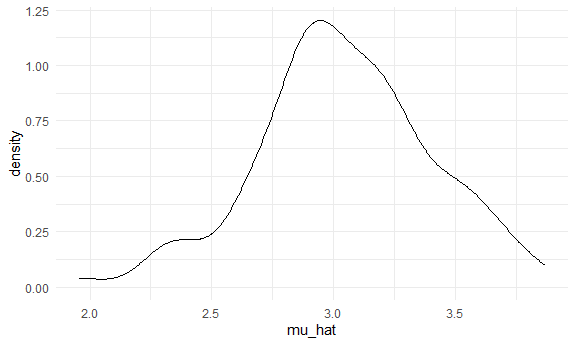
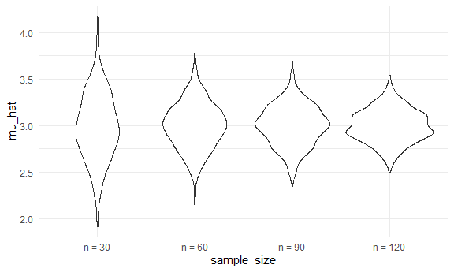
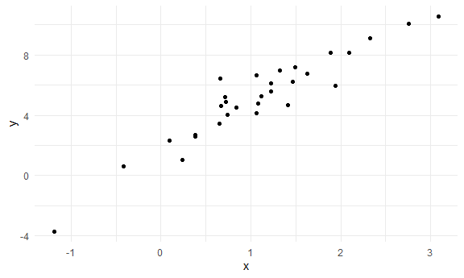
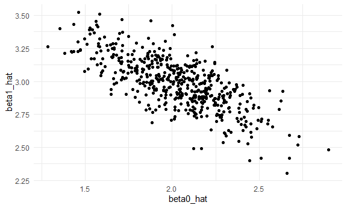
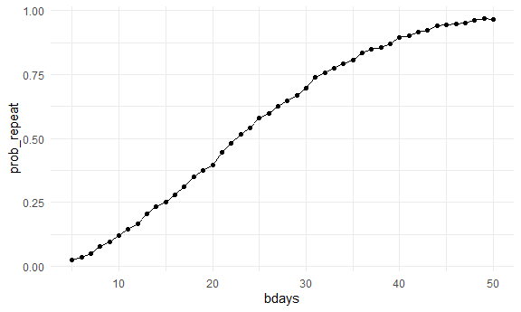

Simulation
================

Load key packages and source necessary files.

``` r
library(tidyverse)

source("source/sim_mean_sd.R")
```

We can “simulate” by running our function.

``` r
sim_mean_sd(n_subj = 400)
```

    ## # A tibble: 1 × 2
    ##   mu_hat sigma_hat
    ##    <dbl>     <dbl>
    ## 1   3.09      1.92

can i “verify” the central limit theorem?

first with a `for` loop

``` r
output = vector("list", length = 100)

# list of 100 dataframes
for (i in 1:100) {
  
  output[[i]] = sim_mean_sd(30)
  
}

output |> 
  bind_rows() |> 
  ggplot(aes(x = mu_hat)) + 
  geom_density()
```



``` r
# creates a normal distribution
```

Try to repeat with a map statement.

``` r
sim_results_df = 
  expand_grid(
    # multiple iterations for multiple sample sizes
    sample_size = c(30, 60, 90, 120), # input
    iter = 1:1000 # more iterations is better
  ) |> 
  mutate(
    # input is the sample size for the function sim_mean_sd
    results = map(sample_size, sim_mean_sd)
  ) |> 
  unnest(results) # dataframe info are turned into columns
```

Let’s look at this:

``` r
sim_results_df |> 
  mutate(
    # make sample size into a factor variable
    sample_size = str_c("n = ", sample_size),
    sample_size = fct_inorder(sample_size)
  ) |> 
  ggplot(aes(x = sample_size, y = mu_hat)) + 
  geom_violin()
```



``` r
# Observation: as sample size increases, distribution of the means gets narrower
```

Let’s try to summarize ..

``` r
sim_results_df |> 
  group_by(sample_size) |> 
  summarize(
    emp_mean = mean(mu_hat),
    emp_se = sd(mu_hat)
  )
```

    ## # A tibble: 4 × 3
    ##   sample_size emp_mean emp_se
    ##         <dbl>    <dbl>  <dbl>
    ## 1          30     2.99  0.357
    ## 2          60     3.00  0.250
    ## 3          90     3.00  0.217
    ## 4         120     3.00  0.178

``` r
# Observation: on average across 1000 iterations, empirical mean is about 3
# looks like what it's supposed to
```

## Simple linear regression

``` r
sim_df = 
  tibble(
    x = rnorm(30, mean = 1, sd = 1),
    y = 2 + 3 * x + rnorm(30, 0, 1)
  )

sim_df |> 
  ggplot(aes(x = x, y = y)) + 
  geom_point()
```



``` r
# fit linear model
slr_fit = lm(y ~ x, data = sim_df)

coef(slr_fit) # gives intercept and slope of the linear model 
```

    ## (Intercept)           x 
    ##    1.787846    3.103274

turn this into a function

``` r
sim_regression = function(n_subj, beta_0 = 2, beta_1 = 3) {
  
  # define stimulated df
  sim_df = 
    tibble(
      x = rnorm(n_subj, mean = 1, sd = 1),
      y = beta_0 + beta_1 * x + rnorm(n_subj, 0, 1)
    )

  # run linear model
  slr_fit = lm(y ~ x, data = sim_df)

  # output intercept and slope
  tibble(
    beta0_hat = coef(slr_fit)[1], # intercept
    beta1_hat = coef(slr_fit)[2] # slope
  )
}
```

``` r
sim_regression(n_subj = 30)
```

    ## # A tibble: 1 × 2
    ##   beta0_hat beta1_hat
    ##       <dbl>     <dbl>
    ## 1      1.98      3.11

``` r
output = vector("list", length = 500)

for (i in 1:500) {
  
  output[[i]] = sim_regression(n_subj = 30)
  
}

output |> 
  bind_rows()
```

    ## # A tibble: 500 × 2
    ##    beta0_hat beta1_hat
    ##        <dbl>     <dbl>
    ##  1      2.72      2.57
    ##  2      2.80      2.46
    ##  3      2.23      2.84
    ##  4      2.21      2.84
    ##  5      1.55      3.25
    ##  6      2.23      2.64
    ##  7      2.01      3.12
    ##  8      1.84      3.45
    ##  9      1.19      3.45
    ## 10      2.24      2.95
    ## # ℹ 490 more rows

``` r
slr_sim_results_df = 
  expand_grid(
    sample_size = 30, 
    iter = 1:500
  ) |> 
  mutate(
    results = map(sample_size, sim_regression)
  ) |> 
  unnest(results)
# there's beta_0 and beta_1 columns

slr_sim_results_df |> 
  ggplot(aes(x = beta0_hat, y = beta1_hat)) + 
  geom_point()
```



``` r
# Observation: when estimated intercept is higher, estimated slope is lower
```

## One more example!

``` r
# 5 people in a room, born between 1 and 365th day of the year
birthdays = sample(1:365, 5, replace = TRUE)

repeated_bday = length(unique(birthdays)) < 5
# unique() pulls out the unique numbers in the sample

repeated_bday # is there a repeated birthday?
```

    ## [1] FALSE

put this in a function

``` r
# n_room is the sampel size
bday_sim = function(n_room) {
  
  birthdays = sample(1:365, n_room, replace = TRUE)

  repeated_bday = length(unique(birthdays)) < n_room

  repeated_bday
  
}

bday_sim(20)
```

    ## [1] TRUE

``` r
bday_sim_results = 
  expand_grid(
    bdays = 5:50, 
    iter = 1:2500 # plot will be jagged if iterations was smaller
  ) |> 
  mutate(
    result = map_lgl(bdays, bday_sim)
  ) |> 
  group_by(
    bdays
  ) |> 
  summarize(
    prob_repeat = mean(result) # average of TRUE or FALSE
  )
```

plot this

``` r
bday_sim_results |> 
  ggplot(aes(x = bdays, y = prob_repeat)) + 
  geom_point() + 
  geom_line()
```



``` r
# Observation: when number of birthdays is small there's a lower probability, while when the number of birthdays is larger there's a larger probability
```
